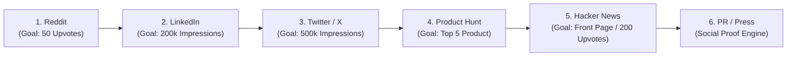

# Launch Strategy & The $1.3M ARR Playbook

This skill helps plan and execute product launches using a structured, repeatable framework paired with the **Martin (YC S23) $1.3M ARR Launch Engine Playbook**.

---

## 🛑 Core Prerequisites & Growth Philosophy

> **DISCLAIMER:** Growth does not matter unless you have good retention. Do **NOT** focus on growth or going viral until you have **at least 10 extremely happy, retained users**.

### The Dual-Track Growth Engine ($0 to $1.3M ARR)
For consumer (B2C) or self-serve B2B SaaS companies:
1. **Track 1: Monthly Channel Launch Push ($0 ➔ $200k ARR)**
   - Launch once a month on a different platform (Reddit ➔ LinkedIn ➔ Twitter ➔ Product Hunt ➔ Hacker News ➔ PR/Press).
   - Commit **3-4 days of focused, intense effort** to create high-converting assets per launch.
   - Monthly platform launches and virality drive initial momentum from $0 to ~$200k ARR.
2. **Track 2: Scalable Paid Channel Exploration ($200k ➔ $1.3M ARR)**
   - In parallel with monthly launches, pick **one** scalable paid channel to master (e.g., Meta Ads / TikTok Ads).
   - Test, iterate, and generate hundreds of creative variations over 3-4 months until the scalable channel hits unit profitability.
   - Scalable ads take the product from $200k ARR to $1.3M+ ARR over the subsequent 6 months.

---

## 🚀 Recommended Channel Launch Order & Playbook

Launch on platforms in this specific order. Later channels require more social proof and traction.

---

### 1. Reddit Launch (Goal: 50 Upvotes)
* **Purpose:** Test ICP, validate messaging early, and acquire initial 20-30 core users.
* **General Advice:** 
  - Find subreddits that explicitly allow self-promotion in official rules.
  - **CRITICAL:** Do **NOT** ask friends or teammates to upvote/comment on Reddit posts. Reddit's anti-spam algorithm detects shared IP addresses and bans accounts instantly. Reddit is not Product Hunt.
  - Immerse yourself in the subreddit's culture first to match tone and vocabulary.
* **The Post:**
  - Craft a magnetic title hook.
  - Always attach a video or high-res product screenshots to occupy maximum feed real estate.
  - Top karma users and moderators indicate how the broader subreddit will react.
* **Examples:**
  - [Mac App Overlay Launch](https://www.reddit.com/r/macapps/comments/1measbu/built_a_tiny_overlay_to_use_chatgpt_anywhere_on/)
  - [Clock Face Day Planner](https://www.reddit.com/r/ProductivityApps/comments/1ri836j/i_built_a_day_planner_around_a_clock_face_instead/)

---

### 2. LinkedIn Launch (Goal: 200k Impressions)
* **Purpose:** Convert high-intent B2B customers, founders, developers, and sales professionals. (First launch generated 250k impressions, 150 trial users, and 60 paying users at $35/mo).
* **The Post:**
  - **First Sentence Hook:** LinkedIn has no title. The first line must compel scrollers to click `...see more`.
  - Attach a high-production launch video or video demo for 3+ extra inches of feed real estate.
  - **Story Formats:** Use short catchy one-liners (Option A) or a compelling 2-3 paragraph essay narrative (Option B).
  - **Tagging Strategy:** Tag inspired friends, early users, and investors in the main post and comments. Tag your official company page to drive algorithm clicks.
  - **Engagement:** Reply and react to **every single comment** immediately after posting.

---

### 3. Twitter / X Launch (Goal: 500k Impressions)
* **Purpose:** Mass awareness and virality.
* **Mechanics:**
  - **Optimize for Reposts:** Reposts drive Twitter algorithm distribution. You can go viral with <1,000 followers if you secure ~100 quality reposts.
  - Attach a polished launch video (budget ~$5k for a video editor or block out 1 week to edit yourself in Premiere/iMovie).
  - Build a private outreach list of Twitter creators/allies to repost upon launch.

---

### 4. Product Hunt Launch (Goal: Top 5 Product of the Day)
* **Purpose:** High conversion rate because PH users are actively hunting for new tools to buy and try.
* **Rules & Cadence:** You can only launch once every 6 months.
* **Swarmer Strategy to Top 5:**
  - Get 5-10 team members/friends on a live call to message contacts simultaneously.
  - Distribute across Slack/Discord communities and LinkedIn connections (using PhantomBuster automation for post-connection messages).
  - First slide MUST be an irresistible video demo.

---

### 5. Hacker News Launch (Goal: Front Page & 200 Upvotes)
* **Purpose:** Acquire hundreds of technical power users and drive front-page discussion.
* **Rules:**
  - Go deep into technical architecture and implementation details.
  - No marketing fluff or corporate buzzwords. Low-production founder walkthrough videos work best.
  - **Comment Moderation:** Top comments are often critical/flaming. Respond politely, constructively, and honestly to win over the silent majority reading the thread.

---

### 6. PR & Press Outreach (Social Proof Engine)
* **Purpose:** Press coverage is not a standalone acquisition channel, but serves as massive social proof when reshared on Twitter and LinkedIn.
* **Execution:**
  - Obtain warm intros to tech journalists whenever possible.
  - Offer exclusives to specific reporters based on their past coverage history.
  - Attach news article screenshots to LinkedIn/Twitter launch posts to double engagement and trust.

---

## 📐 Launch Tiers Framework

Every release maps to one of three tiers:

### Tier 1: Marquee Product / Major Shift (2-4 Weeks Prep)
- **Assets:** High-production launch video, dedicated landing page, deep technical blog post, press embargo outreach, multi-platform campaign, email push to full list.
- **Channels:** All 6 platforms in sequential order (Reddit ➔ LinkedIn ➔ Twitter ➔ PH ➔ HN ➔ PR).

### Tier 2: Major Feature Launch (1-2 Weeks Prep)
- **Assets:** Launch video/GIF, changelog post, updated landing page section, segmented email push.
- **Channels:** LinkedIn, Twitter/X, targeted Reddit subreddits.

### Tier 3: Incremental Polish & Iterations (Same Day Prep)
- **Assets:** Changelog entry, single social post, weekly digest mention.

---

## 📋 Launch Master Checklist & Companion Skills

Use this master checklist for every launch:

| Category | Action | Tier 1 | Tier 2 | Tier 3 |
| :--- | :--- | :---: | :---: | :---: |
| **Strategy** | Verify 10+ Happy Retained Users | ✓ | ✓ | — |
| **Messaging** | Write messaging brief & first-sentence hooks | ✓ | ✓ | ✓ |
| **Assets** | Edit launch video / demo GIF | ✓ | Optional | — |
| **Social** | Reddit post (Subreddit rules checked, no friend upvotes) | ✓ | Optional | — |
| **Social** | LinkedIn post (First sentence hook, video, tagged allies) | ✓ | ✓ | — |
| **Social** | Twitter thread (Repost outreach list primed) | ✓ | ✓ | ✓ |
| **Launchpad** | Product Hunt submission (Tuesday/Wednesday 12 AM PST) | ✓ | — | — |
| **Community** | Hacker News Show HN (Technical depth, polite comment replies) | ✓ | Optional | — |
| **Press** | PR outreach & screenshot social proof cards | ✓ | — | — |

### Companion Skills
- **launch-distribution** — Channel-by-channel execution, posting times & algorithm mechanics
- **launch-tweet** — Copywriting hooks, threads, LinkedIn posts & social templates
- **launch-landing-page** — High-converting landing page layouts & urgency mechanics
- **launch-video** — Scripting, recording, and Remotion video generation
- **launch-email** — Announcement emails, segmentation, and changelog digests
- **launch-metrics** — UTM setup, performance tracking & post-launch retros
